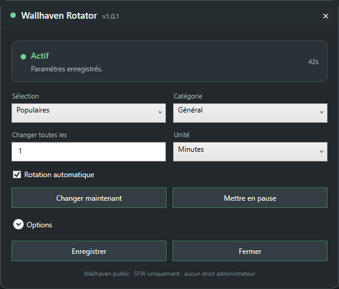

# Wallhaven Rotator

Wallhaven Rotator is a lightweight Windows wallpaper rotator using the public **SFW** Wallhaven API.
The public version history starts at **1.0.0**.

> This project is not affiliated with or endorsed by Wallhaven.

## Screenshot



## Features

- Trending / Popular / New / Random selections
- General / Anime / People / All categories
- Display-aware resolution and aspect-ratio filtering
  - automatic detection of the primary display
  - custom width / height
  - minimum (`atleast`) or exact (`resolutions`) matching
  - automatic or explicit ratios including 16:9, 16:10, 21:9, 32:9, 48:9, 4:3 and 5:4
- Configurable rotation interval
- Manual wallpaper change and pause/resume
- System tray UI
- Persistent history of the last 1,000 wallpaper IDs
- Multi-page selection to reduce repeats
- Cache limited to **50 files and 500 MiB**
- Rotating logs
- User-level autostart
- Update notifications from GitHub Releases
- Optional silent OTA updates, gated by SHA-256 + valid Authenticode + expected SignPath Foundation publisher
- No Windows service and no UAC prompt
- One-file native Windows x64 setup with install/update/uninstall detection

The application only requests SFW results (`purity=100`).

## Download

Use the latest signed file named:

`WallhavenRotator-Setup-vX.Y.Z.exe`

from the [GitHub Releases](../../releases/latest) page.

When a signed build is not yet available, a release may temporarily expose an unsigned provenance build. Automatic updates never execute unsigned or unverifiable installers.

## Requirements

- Windows 10 or Windows 11 x64
- Windows PowerShell 5.1 or newer
- Internet access to Wallhaven

## Build

The setup is compiled with the official Go toolchain. It is not packed, obfuscated, or produced by converting the PowerShell runtime into an executable.

```powershell
./scripts/Build.ps1
```

The GitHub Actions pipeline builds the downloadable installer directly from the public repository and runs regression tests under Windows PowerShell 5.1.

## Updates

Wallhaven Rotator can check the repository's latest stable GitHub Release. Update checks do not add project telemetry.

Automatic installation is opt-in and requires all of the following:

1. the canonical signed setup asset is present;
2. its SHA-256 matches the published checksum;
3. Windows reports a valid Authenticode signature;
4. the signing certificate identifies **SignPath Foundation** as the publisher.

If any verification step is missing or fails, Wallhaven Rotator does not silently execute the installer and instead offers the GitHub Release page.

## Privacy

Wallhaven Rotator contacts Wallhaven for wallpaper functionality and GitHub Releases for optional update checks. There is no project telemetry, analytics account, advertising, or tracking endpoint.

See [PRIVACY.md](PRIVACY.md).

## Security

See [SECURITY.md](SECURITY.md).

## Code signing policy

Free code signing provided by [SignPath.io](https://signpath.io/), certificate by [SignPath Foundation](https://signpath.org/) after project approval.

See [CODE_SIGNING.md](CODE_SIGNING.md).

## Roadmap

The next planned public release is **1.1.0**. Work is tracked in:

- [#1 — Display-aware resolution and aspect-ratio filtering](../../issues/1)
- [#2 — Update notification and optional silent OTA updates](../../issues/2)

No intermediate public release is planned while these items are being developed and tested.

## License

MIT. See [LICENSE](LICENSE).
